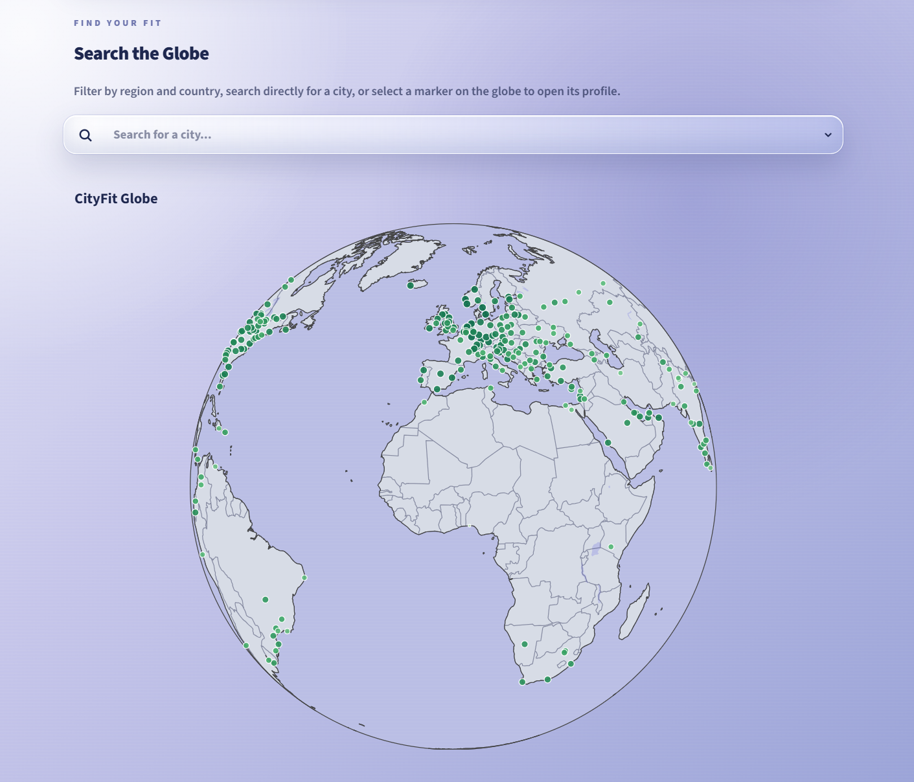
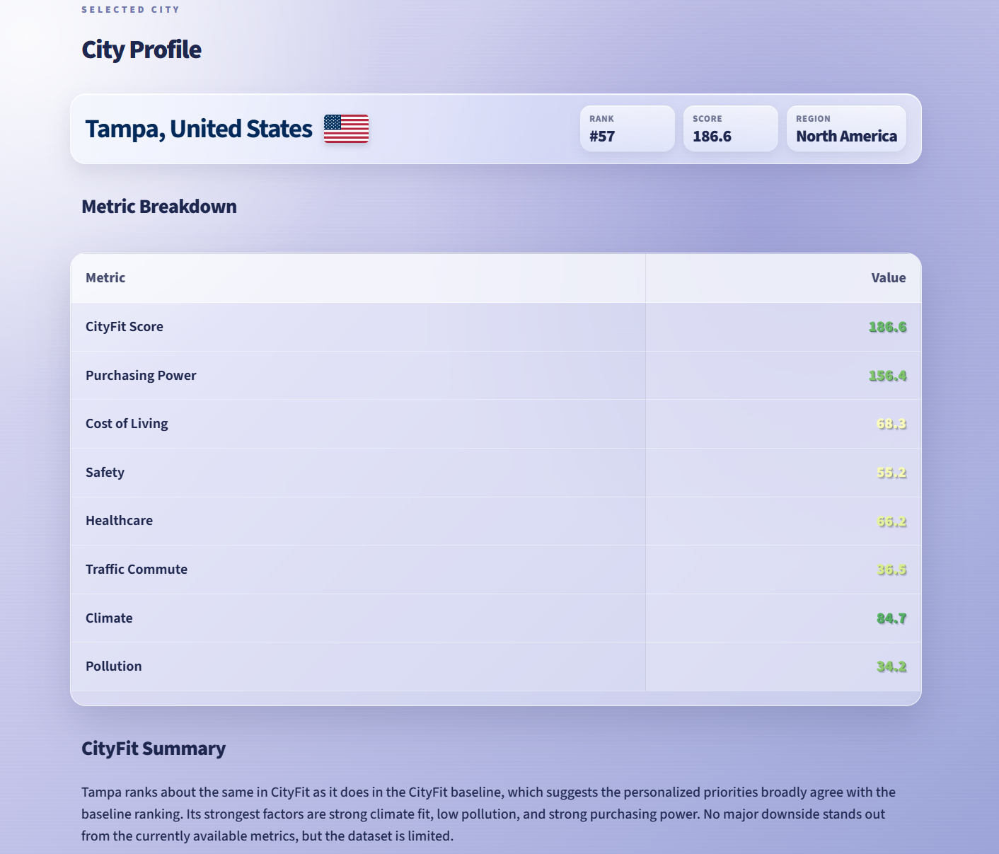
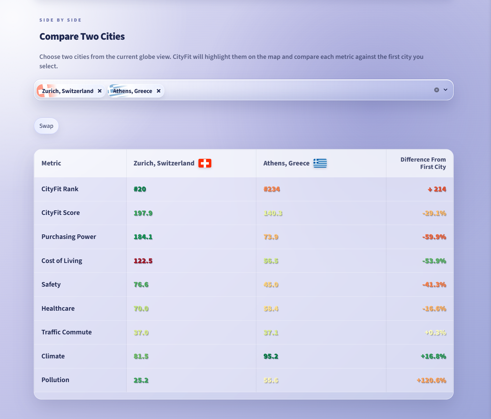
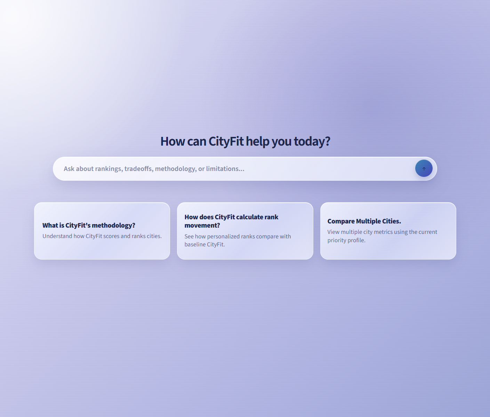

# CityFit

CityFit is a city recommendation and GenAI decision-support platform that ranks cities using Numbeo-style quality-of-life metrics, a personalized CityFit Score, and a RAG-powered agent workflow.

The project is designed to demonstrate applied AI engineering patterns:

- Python/FastAPI backend
- Streamlit frontend
- Dockerized services
- RAG over a local knowledge base
- Agent-style tool orchestration
- Chroma vector database
- MLflow + XGBoost experiment tracking
- Databricks Bronze/Silver/Gold Lakehouse notebooks
- Pytest test coverage
- GitHub Actions CI

## Demo Preview

### Interactive Globe

### City Profile

### City Comparison

### CityFit Agent

## Current MVP

The current version:

- Retrieves methodology and limitation context from a local RAG knowledge base

## Architecture

Raw city metrics CSV
  ↓
Local validation + feature engineering
  ↓
CityFit scoring logic
  ↓
Region/country filtering
  ↓
FastAPI recommendation endpoints
  ↓
Streamlit frontend

GenAI/RAG flow:

User question
  ↓
Streamlit chat UI
  ↓
FastAPI /agent/query
  ↓
Chroma retriever over markdown knowledge base
  ↓
CityFit agent tools:
    - rank_city_recommendations
    - compare_cities
    - get_city_metrics
    - shared region/country scoped recommendation service
  ↓
Response provider:
    - template provider for deterministic responses
    - optional Ollama provider for local LLM-generated responses
  ↓
Structured response:
    - answer
    - compared cities
    - city metrics
    - retrieved sources
    - governance metadata
    - limitations

## Recommendation Service

CityFit uses a shared recommendation service so the FastAPI endpoints and agent tools rely on the same ranking pipeline.

The shared service handles:

- loading raw city metrics
- validating required schema fields
- calculating CityFit scores
- adding CityFit baseline and personalized ranks
- applying optional region and country filters
- adding human-readable city explanations where needed

This avoids separate API and agent ranking logic drifting out of sync.

## Scoring Methodology

CityFit starts with quality-of-life metrics and transforms them into priority-specific feature scores. The personalized CityFit Score combines a source quality-of-life baseline with a weighted lifestyle adjustment based on the user's selected priorities.

The Streamlit UI uses user-friendly 0–10 priority sliders. These are normalized before being sent to the API:

* `0` means the priority is ignored
* `5` means default importance
* `10` means double importance

Internally, the API receives these as 0–2 priority multipliers.

CityFit also calculates a neutral baseline ranking where every priority is set to default importance. Personalized rank movement compares the user's personalized ranking against this neutral CityFit baseline.

## Run with Docker

Build the containers:

`docker compose build`

Run the ranking pipeline:

`docker compose run --rm cityfit python -m scripts.run_cityfit_ranking`

Run the FastAPI backend:

`docker compose up api`

FastAPI docs:

`http://localhost:8000/docs`

Run the Streamlit frontend:

`docker compose up api streamlit`

Streamlit app:

`http://localhost:8501`

Run the full app with deterministic/template responses:

`docker compose up api streamlit`

Run the full app with local Ollama available:

`docker compose up api streamlit ollama`

If using Ollama for the first time, pull a model:

`docker exec -it cityfit-ollama ollama pull llama3.1:8b`

For faster local testing, use a smaller model:

`docker exec -it cityfit-ollama ollama pull llama3.2:3b`

## RAG Knowledge Base

The RAG system retrieves from markdown documents in:

`data/knowledge_base/`

Current knowledge-base files:

- `cityfit_methodology.md`
- `data_limitations.md`
- `quality_of_life_index_notes.md`
- `relocation_risk_framework.md`
- `responsible_ai_policy.md`

Ingest the knowledge base into Chroma:

`docker compose run --rm cityfit python -m cityfit.rag.ingest`

Test retrieval:

`docker compose run --rm cityfit python -m cityfit.rag.retriever`

Generated vector database files are stored locally in:

`data/vector_store/`

This folder is ignored by Git because it is a generated artifact.

## LLM Providers

CityFit supports provider-swappable response generation.

Current providers:

- `template`: deterministic response generation with no LLM required
- `llm`: local Ollama response generation

The default mode is `template` because it is reproducible, fast, and free.

The Ollama provider can be enabled for more natural language responses while still using the same retrieved context, city metrics, and agent tools.

Supported local models can be configured through Docker environment variables:

- `OLLAMA_BASE_URL`
- `OLLAMA_MODEL`

## API Endpoints

### Health Check

`GET /health`

### City Recommendations

`POST /recommend`

Returns ranked city recommendations based on user priorities, with optional region and country filters.

### Agent Query

`POST /agent/query`

Returns an auditable agent-style response with:

- answer
- compared cities
- city results
- retrieved context
- sources
- prompt version
- data version
- tools used
- limitations

The agent respects the same region and country filters as the recommendation endpoint.

## Databricks Lakehouse Pipeline

The Databricks notebooks implement a medallion architecture:

- `01_ingest_bronze.py`: reads the raw CSV and writes a Bronze Delta table
- `02_clean_silver.py`: validates schema, casts types, removes duplicates, and writes a Silver Delta table
- `03_feature_engineering_gold.py`: calculates CityFit Score, adds ranking fields, and writes a Gold recommendation table
- `04_train_ranking_model.py`: trains an XGBoost ranking model and logs the experiment with MLflow

Tables:

- `bronze_city_quality_of_life_raw`
- `silver_city_quality_of_life_metrics`
- `gold_cityfit_recommendations`
- `gold_cityfit_model_predictions`

## MLflow + XGBoost

CityFit includes an XGBoost ranking model tracked with MLflow.

The current model uses synthetic labels derived from the CityFit Score:

`is_good_fit = 1 if city is in the top 30% by CityFit Score`

This is useful for demonstrating a supervised ML workflow, but it is not the same as training on real user behavior.

Train the local model:

`docker compose run --rm cityfit python -m cityfit.models.train_ranker`

Run local model predictions:

`docker compose run --rm cityfit python -m cityfit.models.predict`

Launch the MLflow UI:

`docker compose up mlflow`

MLflow UI:

`http://localhost:5000`

## Testing

Run all tests:

`docker compose run --rm cityfit pytest`

The test suite covers:

- schema validation
- CityFit scoring
- reusable recommendation filtering
- FastAPI endpoints
- region and country scoped recommendations
- RAG retrieval
- agent response structure and governance metadata
- API/agent consistency for filtered recommendations
- deterministic CityFit ranking behavior
- baseline CityFit vs personalized CityFit rank movement
- frontend city comparison color behavior

## Data Notice

This project uses an educational city dataset derived from publicly available Numbeo city ranking pages. Numbeo data is credited to Numbeo.com and is not covered by this repository's code license.

This project does not redistribute a full Numbeo dataset or use automated scraping.

## Limitations

- The current dataset is intended for educational/portfolio use and may not reflect every city or the latest real-world conditions.
- CityFit scoring is heuristic and based on configurable weights.
- The ML model currently uses synthetic labels derived from the CityFit Score.
- The agent supports deterministic template responses and optional local Ollama responses. Hosted LLM providers such as OpenAI, Anthropic, Gemini, or Bedrock are not yet implemented.
- Recommendations are informational and should not be treated as financial, legal, immigration, medical, or relocation advice.

## Roadmap

Planned improvements:

- Add a dedicated in-app methodology page
- Expand city detail pages with richer lifestyle summaries
- Add hosted LLM providers such as OpenAI, Anthropic, Gemini, or Bedrock
- Add response-mode evaluation for template vs Ollama outputs
- Add more knowledge-base documents
- Add model/provider evaluation harness
- Add optional AWS storage or deployment proof of concept
- Add screenshots and UI polish
